# Monthly Household Budget Analysis with Power BI

## Overview
This Power BI project aims to provide insights and analysis into my monthly household budget for 6 months from December 2023 to May 2024.  By leveraging Power BI's capabilities, I want to track your expenses, monitor spending trends, and make informed financial decisions. I intend to do a separate in depth analysis of each line item I have spent on using my bank statements on my personal transactions as the data used in this analysis is based on our projections and usual expenses.

## Dataset
The dataset used in this project consists of your fortnightly household expenses categorized into different spending categories such as rent, insurance, groceries, fuel. Each entry includes the description, date, amount, and whether the transaction is to be paid from my account (Mildred) or my husbands' (Martin). 

The dataset was exported from an excel sheet I created for the time period. Below is a snippet of the raw data. I did some cleaning in excel but will finish some of the transformations in PowerBI.
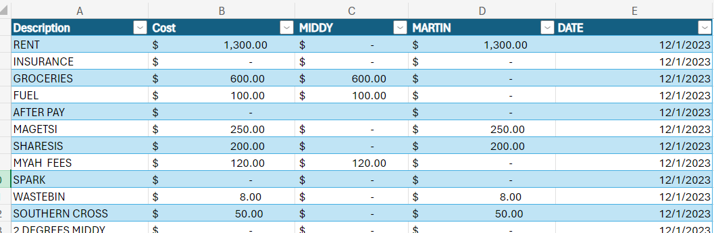

##TRANSFORMATIONS ON THE DATASET

The first transformation I made was converting my row 1 into column headers
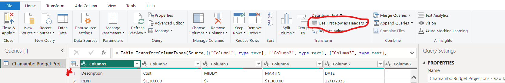

Next I removed a column with no data
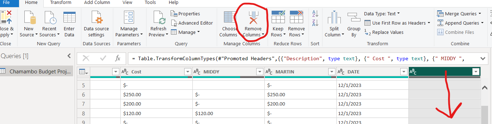

Changed data types to accounting ($) and date 
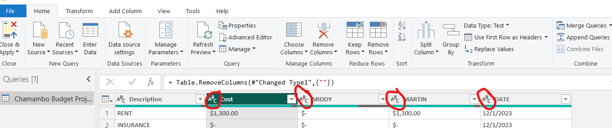

Replaced errors with 0
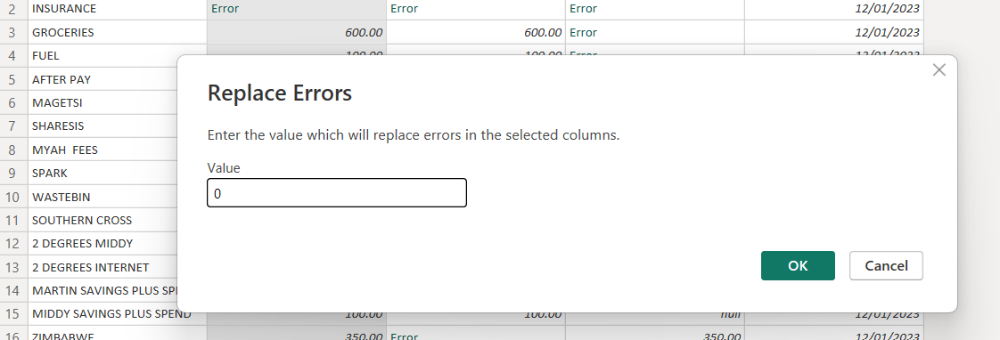

Replace null with 0
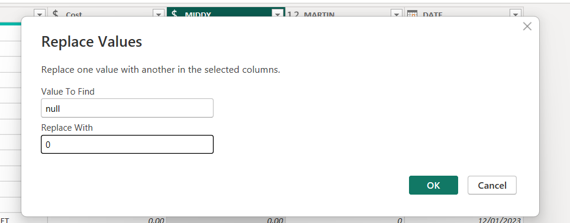

## Metrics and Analysis
### 1. Total Forghtnightly Expenses
- This metric provides an overview of your total expenses for every forghtninght from 1 December 2023 and 1 April 2024  helping us to understand which fortnight we spent the most so we can drill down to find out why
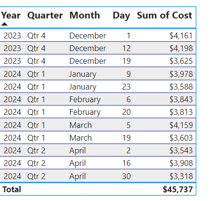

### 2. Expense Breakdown by Category
- Analyzing expenses by its description allowed us to identify areas where we are spending the most. It helps in budget allocation and identifying potential areas for cost-saving.
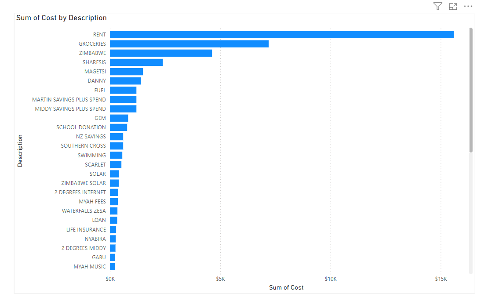

### 3. Monthly Trends
- Tracking monthly trends helped us to understand fluctuations in your expenses over time. It enabled us  to anticipate future expenses and plan accordingly. I also super imposed an average cost line 
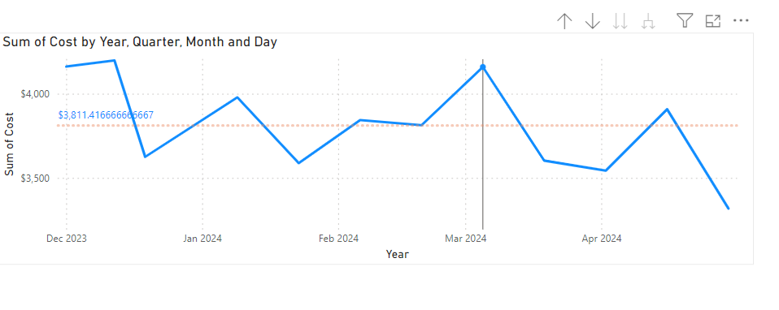

### 5. Top Spending Categories
- Identifying the top 10 spending categories gives you insights into where the majority of your budget is being allocated. It helps in prioritizing areas for optimization.
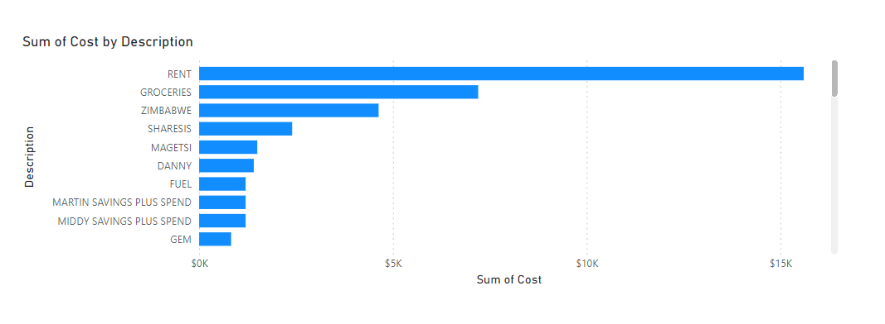

I then published my report in Power BI service to create a dashboard.
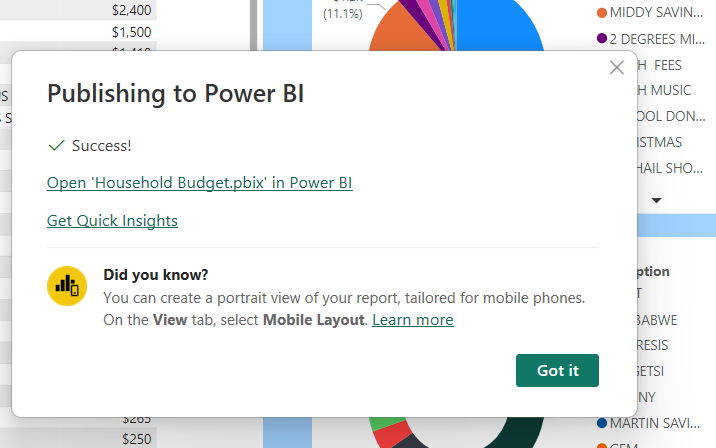

## Dashboard Layout
The Power BI dashboard is designed to provide an intuitive and user-friendly interface for exploring your household budget data. It consists of the following components:
1. **Monthly Expense Overview**: A summary of total fortnightly expenses.
2. **Expense Breakdown**: A visual representation of expenses by category.
3. **Monthly Trends**: Line chart showing monthly spending trends.
4. **Top Spending Categories**: Bar chart highlighting the top spending categories.
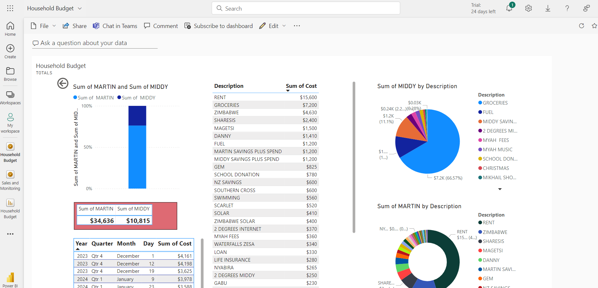

## How to Use
1. **Data Refresh**: Ensure that your dataset is regularly updated with the latest expense data.
2. **Interact with Visuals**: Use filters and slicers to drill down into specific time periods or categories.
3. **Set Budget Targets**: Adjust budget targets as needed to align with your financial goals.
4. **Track Progress**: Monitor your budget performance regularly to stay on track with your financial objectives.

## Additional Resources
- [Power BI Desktop](https://powerbi.microsoft.com/desktop/)
- [Power BI Service](https://powerbi.microsoft.com/service/)
- [Power BI Community](https://community.powerbi.com/)

## Contributors
-Mildred Chamambo

## License
This project is licensed under the [MIT License](https://opensource.org/licenses/MIT).

---

Feel free to customize this README template according to your specific project requirements and preferences.